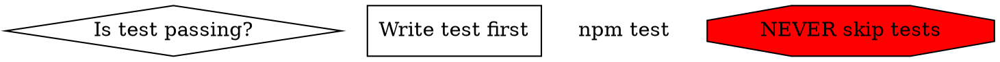

# DOT Graphs for Workflow Diagrams

For complex decision trees in skills, embed DOT graphs:

Run `scripts/render_graphs.py <skill-path>` to render SVG.

## Node Shapes

- `diamond` — decisions/questions
- `box` — actions (default)
- `plaintext` — literal commands
- `ellipse` — states
- `octagon` (red) — STOP/warnings
- `doublecircle` — entry/exit points
